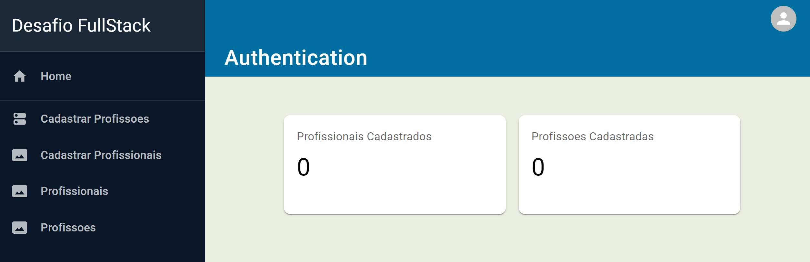

<h1 align="center">Projeto - CRUD</h1>
 

  

> trata-se de projeto fullstack, com CRUD implementado, conexão com banco de dados, relacionamento na tabela, utilizando MUI, react, vite, railway

### 🏠 [Homepage](https://frontend-five-nu.vercel.app/)

### ✨ [Demo](https://frontend-five-nu.vercel.app/)

  <a href="#-tecnologias">Tecnologias</a>&nbsp;&nbsp;&nbsp;|&nbsp;&nbsp;&nbsp;
<!--   <a href="#-layout">Layout</a>&nbsp;&nbsp;&nbsp;|&nbsp;&nbsp;&nbsp; -->
  <a href="#-instalação">Instalação</a>&nbsp;&nbsp;&nbsp;|&nbsp;&nbsp;&nbsp;
  <a href="#memo-licença">Licença</a>

  

 

<!-- ## 🏆 Aprendizados
  ### Vite
   -->

## 🚀 Tecnologias

Esse projeto foi desenvolvido com as seguintes tecnologias:
- Vite
- TypeScript
- MUI
- Railway
- HTML e CSS
- [Node e NPM](https://nodejs.org/)

<!-- 
## 🎨 Layout

  - [Layout do projeto](https://www.figma.com/community/file/1195050524500542670) -->

## 💿 Instalação

|                    Script | Target                                             |
| ------------------------- | -------------------------------------------------- |
|                    `npm i` | Instala as dependências do projeto      |
|                    `npm run dev` | Roda o projeto no ambiente de desenvolvimento         |

## Autor

👤 **Saullo Almeida**

* Github: [@saulloalmeida](https://github.com/saulloalmeida)
* LinkedIn: [@saullo-almeida](https://linkedin.com/in/saullo-almeida)
* Twitter: [@saulloalmeida](https://twitter.com/saulloalmeida)
<!-- ##  -->

Dê uma ⭐️
